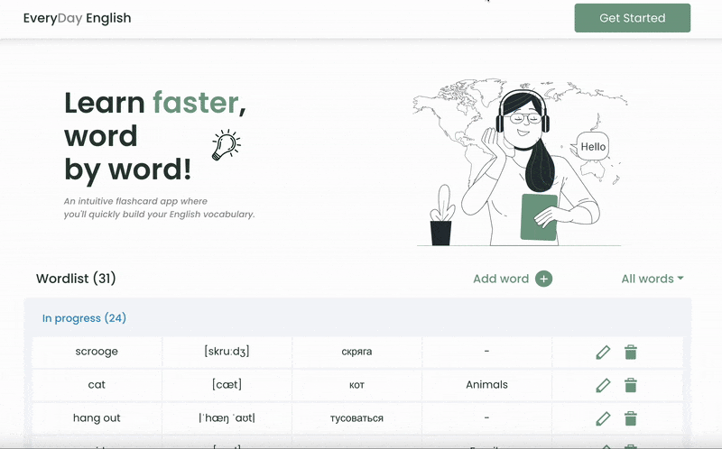

# EveryDay English 🇬🇧

**A React-based single-page application (SPA) for learning English vocabulary with animated flashcards.**

## ✨ Overview

EveryDay English is an interactive vocabulary trainer designed to help users memorize English words through engaging flashcards. The app expands your English vocabulary effectively and helps track which words are already learned. The UI is fully responsive and enriched with animations for a smooth learning experience.

## 🚀 Demo

## 🔧 Features

- 📚 Add, edit, delete words
- ✅ Filter by learned/in progress status
- 🔄 Shuffle and undo functionality
- 🧠 Flip animation for flashcards
- 📱 Fully responsive layout
- 🔃 Loader component for fetching data
- 🪄 Success and error messages for server interactions
- 💾 Progress saved in `localStorage`
- ⛔ Custom 404 page
- ⬆ Scroll-to-top button

  ## ⚙️ Technologies Used

- **React** (Vite)
- **MobX** for state management
- **Fetch API** for backend interaction
- **SASS/SCSS** with CSS modules
- **React Router** for routing
- **React Bootstrap** (dropdown component)
- **Figma** for UI design and prototyping
- **localStorage** for saving progress (backend support is missing)

## 📦 Getting Started

Clone the repository and start the development server:  

git clone https://github.com/lynchdiva/flashcard-app.git  
cd everyday-english  
npm install  
npm run dev  
